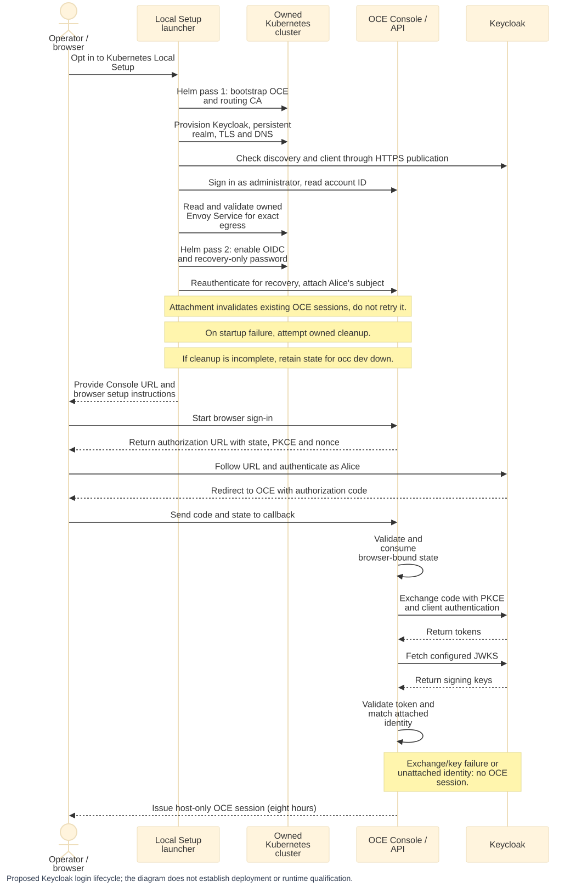

# Proposal: Verify Keycloak OIDC sign-in locally and in CI

- **ID:** RFC-0019
- **Owner:** freeqaz (proposal and auth review); CI and Local Setup review: OCE maintainers.
- **Created:** 2026-10-03
- **Last updated:** 2026-10-08 (implementation open as a six-PR stack, see Delivery)
- **RFC PR:** [#1117](https://github.com/openclaw/openclaw-enterprise/pull/1117)
- **Related:** [RFC-0001](0001-oidc-sign-in.md) (generic OIDC sign-in; implementation
  [#790](https://github.com/openclaw/openclaw-enterprise/pull/790));
  [OIDC sign-in guide](../../docs/guides/deploy/oidc-sign-in.md); in-cluster IdP egress note
  [#903](https://github.com/openclaw/openclaw-enterprise/pull/903); token service
  [RFC #924](https://github.com/openclaw/openclaw-enterprise/pull/924).

## Problem and decision

OCE’s [generic OIDC sign-in](0001-oidc-sign-in.md) has relied on the [synthetic provider](../../tests/helpers/production-sign-in.mjs) in merged automated coverage; the open implementation stack adds real-provider CI. Earlier manual checks for #790 and dogfood found defects fixed by #903 and #806, but their harnesses were not checked in, and the existing [OIDC guide](../../docs/guides/deploy/oidc-sign-in.md) gives operators limited Keycloak-specific guidance.

This RFC proposes one shared, pinned Keycloak realm as the basis for a documented provider recipe, a real-provider browser CI lane, and an opt-in Kubernetes Local Setup sign-in profile. The goal is to make the supported configuration and its verified flows repeatable without changing product authentication or adding test-only controller behavior. Local Setup would retain its realm across restarts and attach the development administrator to a Keycloak identity; the administrator password remains available for recovery.

Keycloak authenticates **humans**; OCE IAM continues to determine what the attached account may do. The resulting Console session is the existing eight-hour, non-refreshing OIDC session. **Agent and other machine credentials** remain separate: this proposal does not issue IdP tokens to API clients or change service keys or other Agent credentials. [Controller bearer authentication](../../apps/controller/src/auth/index.ts) stays disabled. Bootstrap still writes a 30-day service key; shorter lifetimes use the [service-key API](../../docs/reference/authentication/service-api-keys.md) (`expiresIn`). Short-lived IdP-issued machine credentials are the subject of [RFC #924](https://github.com/openclaw/openclaw-enterprise/pull/924).

The profile carries tradeoffs: it requires host loopback port 443, browser trust setup, and a Kubernetes installation; OIDC’s existing [host-only cookie and native-administrator exclusivity rules](../../deploy/helm/openclaw-enterprise/templates/_helpers.tpl) still apply, preserving RFC-0007 and RFC-0001’s cookie-scope decision. This proposal does not make the development Keycloak configuration production-ready, verify other providers, or add claim mapping, just-in-time accounts, new logout flows, runtime discovery, private-key client authentication, or new chart knobs for IdP trust and egress. RFC-0001’s status is unchanged.

## Provider contract and trust

The proposal uses one checked-in [realm file](https://github.com/openclaw/openclaw-enterprise/blob/6339219af56d7740bc93f54512962ea10f585de7/tests/fixtures/keycloak/realm-oce.json) for the guide, Local Setup, and the CI lane. It defines realm `oce`, a confidential client `oce-console`, and users `alice` and `carol` with fixed subject identifiers. The client permits the authorization-code flow only, requires PKCE `S256`, and has one redirect URI; implicit and direct grants are disabled. Both environments read the same digest-pinned Keycloak 26.x image from `tests/fixtures/keycloak/image.json`.

The realm file contains placeholders for the redirect URI, client secret, and user passwords, not their values. Secrets are generated per run or installation and kept in `0600` files. Unset placeholders import as literal text (observed in 26.7.5), so startup refuses empty values and verifies the imported client secret and redirect URI through the Keycloak admin API. Keycloak administrator credentials stay confined to the CI fixture or local development installation and its private state.

The provider recipe requires a default `RS256` signing key of at least 2,048 bits and no audience mapper: the ID token’s audience is the client ID, and OCE rejects other audiences. `KC_HOSTNAME` is the HTTPS origin without a port or path; the configured issuer must match `${KC_HOSTNAME}/realms/<realm>` exactly. The issuer, authorization, token and JWKS URLs must share one DNS host, use HTTPS on port 443 without an explicit port in their URLs, and present a certificate trusted by the API. When the API runs in a Pod, the host must not end in `.localhost`, which resolves to loopback there. The [Keycloak guide](https://github.com/openclaw/openclaw-enterprise/blob/6339219af56d7740bc93f54512962ea10f585de7/docs/guides/deploy/oidc-keycloak.md) in the open stack describes the provider recipe. The controller uses configured endpoints, never runtime discovery, and fetches JWKS at each callback; an unavailable token or JWKS endpoint fails sign-in closed.

A user begins at the Console and authenticates with Keycloak. OCE accepts the resulting identity only when its exact issuer and subject, for the configured client, are already attached to an OCE account; an unattached identity is rejected rather than creating an account. Keycloak authenticates the user, while OCE IAM determines that account’s permissions. Successful sign-in creates the existing eight-hour, non-refreshing OCE session. Disabling a user in Keycloak prevents the next sign-in but does not end an existing OCE session. Console sign-out ends only the OCE session; while the Keycloak session lives, one click can sign the user in again. Offboarding must revoke OCE access too.

Local Setup attaches `alice` to the development administrator. The administrator password remains available for recovery only; OIDC and native embedded administration remain mutually exclusive. This development Keycloak uses `start-dev` and a dev-file database and is not a production-ready IdP recipe.

## Local setup and lifecycle

The proposed `OCC_DEVELOPMENT_SIGN_IN=keycloak` profile runs only with Kubernetes compute and control plane and `OCC_DEVELOPMENT_SANDBOX_DRIVER=none`. Other profiles refuse the setting. It reserves host loopback port 443 for Keycloak and rejects conflicting configured ports or an existing listener before provisioning. k3d must publish `127.0.0.1:443:30443@loadbalancer` when the cluster is created; enabling the profile on a cluster without that publication requires `occ dev down` followed by `occ dev up`.

The [first Helm pass](../../internal/occdev/openshell_k3d.go) installs OCE with password sign-in. The launcher then installs the pinned Keycloak image and shared realm, with generated credentials in `0600` files. A persistent volume keeps the realm across Pod restarts. Realm import occurs only when the realm is absent; a changed realm file produces an installation-time warning, and replacing the realm requires teardown. `occ dev down` destroys the realm volume.

A dedicated Gateway terminates TLS for `keycloak.occ-dev-<name>.oce.test`; CoreDNS directs in-cluster requests to its Envoy Service. The API trusts the gateway CA through `NODE_EXTRA_CA_CERTS`. Readiness checks discovery through `127.0.0.1:443` using only the exported CA, then checks the client through the admin API; it does not wait for the Gateway’s Programmed condition. Before enabling OIDC, the launcher validates the dedicated Service’s identity, ownership, ports and addresses through the owned cluster context. It permits egress to those exact IPv4 Service addresses as `/32` CIDRs and retains the selector-scoped rule for Envoy Pods on port 10443. Missing, invalid, unowned or unsupported addresses fail closed before the second pass.

After Keycloak readiness succeeds, the launcher authenticates to the Console as the bootstrap administrator and reads that account’s ID. Its client verifies the Console CA, sends the exact Origin, keeps cookies in a session jar and refuses redirects. The second Helm pass enables OIDC, sets `auth.recoveryUserId`, selects `auth.passwordSignIn: recovery-only` and sets `agentNativeAdmin.enabled: false`. Once OIDC is available, the launcher obtains a fresh recovery session and posts Alice’s subject and the current account version to `/api/auth/accounts/<id>/providers/oidc` (409 while OIDC is off). Attachment invalidates the account’s existing sessions; the launcher does not retry the identity mutation.

Startup prints the Console URL, credential paths, two CA certificates and the host entry needed for browser access. The operator imports the Console browser CA and Keycloak gateway CA and adds the printed hosts entry. Automated browser qualification uses fixture trust and does **not** prove that a person has successfully imported the CAs into a browser.

On startup failure or `occ dev down`, cleanup attempts to remove owned resources. If cleanup is incomplete, private state is retained for a subsequent `occ dev down` recovery; manual hosts entries and browser CA imports remain the operator’s responsibility. See the [local Kubernetes development guide](https://github.com/openclaw/openclaw-enterprise/blob/4eadb9782cda33b4e891ae277a81f50b0bec4958/docs/guides/deploy/local-kubernetes-development.md#sign-in-through-keycloak).

**Proposed sign-in lifecycle.** The diagram describes the proposed flow; the implementation PRs remain open.

[Editable diagram source](../assets/0019-keycloak-oidc-verification/request-lifecycle.mmd).

## Verification

The proposed `keycloak-oidc` lane uses PostgreSQL and runs a digest-pinned Keycloak and a real Chromium login against OCE’s production sign-in composition behind the shared [HTTPS ingress helper](../../tests/helpers/console-app.mjs). It checks discovery and JWKS, attached Alice’s sign-in with both `client_secret_post` and `client_secret_basic`, rejection and audit of unattached Carol, signing-key rotation without an OCE restart, and OCE sign-out, one-click re-sign-in and disabling a user in Keycloak. It observes `scope=openid`, `S256`, nonce and the exact redirect URI; Carol is audited as `EXTERNAL_IDENTITY_REJECTED` without an account. The API uses its normal token and JWKS transport. The lane checks named tests for skips, uses bounded image-pull retries and 180-second readiness, reports the failing step, and cleans up the Keycloak resource even after failure. The stack schedules it in full-mode PR CI, pushes to `main`, and Full Integration `all`, with a 25-minute job budget (the CI job uses `blacksmith-8vcpu-ubuntu-2404`); it is in the `full` suite group, not `CI Required`, as [First Agent smoke](../../docs/testing/first-agent-smoke.md) began. The separate `dev-up-k3d` launcher lane runs locally or by manual hosted dispatch, outside automatic CI and `all`. See the [testing guide](https://github.com/openclaw/openclaw-enterprise/blob/6339219af56d7740bc93f54512962ea10f585de7/docs/testing/keycloak.md).

The lane generates a two-day CA, sets Node trust before test startup, and pins Chromium trust to its two leaves. It holds loopback 443, adds an owned hosts entry with `sudo -n` if IPv4 resolution requires it, and removes the container, hosts entry and private files on cleanup. Its container runs as root to read the `0600` TLS key.

The real-provider Alice flow verifies acceptance of Keycloak’s default ID token. Extra-audience rejection and fail-closed behavior during a provider outage remain covered by synthetic `fakeOidc` tests; they are not claims about the live Keycloak run.

As of October 8, the first implementation arm had passing real-Keycloak CI artifacts: one test for [#1133](https://github.com/openclaw/openclaw-enterprise/pull/1133), four for [#1134](https://github.com/openclaw/openclaw-enterprise/pull/1134), and six each for [#1135](https://github.com/openclaw/openclaw-enterprise/pull/1135) and [#1136](https://github.com/openclaw/openclaw-enterprise/pull/1136), with no failures, skips or todos and successful cleanup. The retained verification records identify tested merge commits containing the respective PR heads. The [hosted launcher run](https://github.com/openclaw/openclaw-enterprise/actions/runs/37796527211) at [#1138](https://github.com/openclaw/openclaw-enterprise/pull/1138) head `4eadb9782cda33b4e891ae277a81f50b0bec4958` passed all six cases, including browser sign-in, realm persistence after Pod replacement, injected second-pass and cluster-deletion failures with retained recovery state, and cleanup. The result’s `sourceSha` matches that head, with zero failures, skips or todos; lane cleanup and the targeted Full Integration Aggregate succeeded. This was not an `all` run. Its browser used fixture trust; it does not establish that a person imported the CAs manually. Its Agent model response used a deterministic fixture, not a live external model provider.

The **October 4 snapshot** remains historical evidence:

- CI run [37166912213](https://github.com/openclaw/openclaw-enterprise/actions/runs/37166912213), on the then-combined stack at `ad9eda703` (`ci/keycloak-e2e`), recorded 6/6 Keycloak cases, no skips, and green required, PostgreSQL OIDC, Console Browser and k3d checks. The runner’s IPv4/IPv6 answer exercised the `sudo -n` hosts path; startup took 20.6 seconds.
- Three clean developer runs passed 6/6 in a private network namespace. Forced busy-port, bad-digest and unset-placeholder failures named their step and cleaned up.
- Dogfood verified Carol’s Namespace read (200), denied writes/admin reads (403), ordinary-password refusal (401), recovery-password success (200), Alice’s eight-hour `__Host-` session, a one-day service key through revocation, and sign-out/re-sign-in. It was then restored to password-only.
- Launcher-rendered resources applied to dogfood verified the NodePort, Pod DNS and 10443 egress, sign-in, realm persistence after Pod deletion, and Namespace cleanup. This was cluster-side coverage only.

That snapshot did not verify complete launcher up/down, host publication/discovery, human CA imports, Full Integration `all`, other IdPs or other versions. October 8 adds hosted launcher proof; human browser setup and the complete `all` run remain unqualified by this evidence. Neither snapshot establishes current adoption.

## Delivery, rationale and decisions

The six implementation PRs form two branches from the shared fixture and lane:

| PR                                                                 | Scope                                                | Depends on |
| ------------------------------------------------------------------ | ---------------------------------------------------- | ---------- |
| [#1133](https://github.com/openclaw/openclaw-enterprise/pull/1133) | Realm, pinned image, lane and discovery              | `main`     |
| [#1134](https://github.com/openclaw/openclaw-enterprise/pull/1134) | Real browser sign-in                                 | #1133      |
| [#1135](https://github.com/openclaw/openclaw-enterprise/pull/1135) | Key rotation and session lifecycle                   | #1134      |
| [#1136](https://github.com/openclaw/openclaw-enterprise/pull/1136) | Operator guide                                       | #1135      |
| [#1137](https://github.com/openclaw/openclaw-enterprise/pull/1137) | Persistent local Keycloak and networking             | #1133      |
| [#1138](https://github.com/openclaw/openclaw-enterprise/pull/1138) | Local sign-in, attachment and launcher qualification | #1137      |

Land parents first and recheck each child against its updated base. The RFC remains proposed and requires a human merge.

A separate provider lane keeps the Keycloak image pull and JVM startup out of the existing required PostgreSQL auth lane. Using the normal transport also avoids proving a patched request path. Costs remain: about 450 MB to pull, 20–50 seconds to start and roughly 1 GB of memory, selectors tied to the pinned login form, contention for loopback port 443, and persisted realms that require `occ dev down` to pick up a changed fixture.

Other original alternatives remain rejected: `unshare -rn` as the CI design (Ubuntu 24.04 restrictions), a `.localhost` launcher name (Pod loopback), Testcontainers (obscures the selected digest/retry policy), and the dogfood browser workaround (port-forward and special browser launch).

Human decisions remain:

- **freeqaz:** readiness and the recovery-only/native-administration tradeoff; whether dogfood keeps OIDC enabled, losing embedded-Agent browser chat; and who completes the real-browser CA/hosts check before #1137/#1138 land.
- **freeqaz:** proposed promotion to required CI after two weeks green on `main` without infrastructure failures, by adding the `ci.yml` `pr-safe` entry and `test-suites.json` `ci` membership.
- **Maintainers:** the proposed 26.x digest policy, with image bumps and login-selector rechecks; and a separate chart-topology lane, whose original proposed default is “not now” because Local Setup supplies that topology on demand.

Hosted browser coverage does not resolve the human-browser check, and no design acceptance is inferred.
